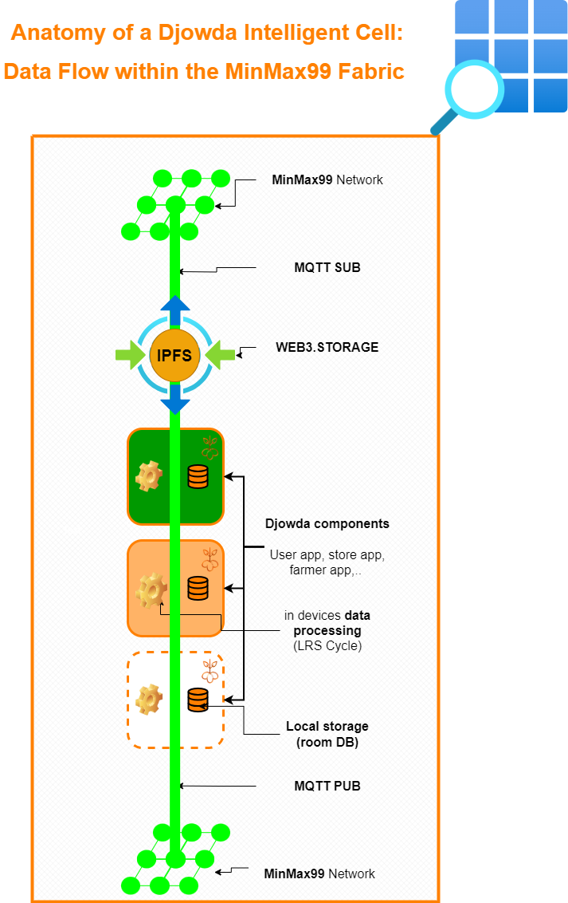

# Djowda Intelligent Cell (DIC)

**Modular, self-aware units for decentralized food ecosystems.**

The **Djowda Intelligent Cell (DIC)** is a core structural unit within the Djowda ecosystem. Inspired by biological neurons and powered by edge + decentralized technologies, each DIC exists inside a precise geospatial tile of the **MinMax99 Grid** and can host one or more **Djowda components** such as the store app, user app, delivery app, or farmer app.

---

## 🧭 How It Works

Each DIC operates within a 500m² **MinMax99 Cell**, derived from GPS using a deterministic function. The DIC hosts multiple apps (components) that **learn**, **remember**, and **share** data autonomously, using lightweight, resilient protocols.

- ✅ **Learn** from local sensors, input, or user activity
- ✅ **Remember** data using local storage (Room DB) and decentralized storage (IPFS via Web3.Storage)
- ✅ **Share** intelligence with nearby Cells through MQTT (Pub/Sub)

---

## 🔄 Inside a DIC: Key Layers

- **MinMax99 Integration** – Defines exact location identity and neighboring Cells
- **Djowda Components** – Store app, user app, delivery app, etc.
- **LRS Cycle** – Executed at the component level, powering autonomous intelligence
- **Room DB** – Stores structured local memory
- **MQTT (Pub/Sub)** – Enables real-time communication between Cells
- **IPFS / Web3.Storage** – Used for persistent, shareable, decentralized knowledge

> 📌 *Each component inside a DIC runs its own LRS cycle and contributes to a resilient, collaborative ecosystem.*

---

## 📊 Visual: DIC in the MinMax99 Fabric

_Above: A single DIC embedded in the MinMax99 Grid, showing the data flow from local apps up through IPFS, and out to other Cells via MQTT._

---

## 🔬 Use Case: Self-Aware Local Store

A store app within a DIC can:
- Track inventory shifts
- Detect local demand changes
- Communicate supply needs to neighboring farmer or delivery Cells
- Function offline and sync when available

---

## 🧪 Testing Roadmap

- **Phase 1**: Single-Cell behavior and LRS simulation
- **Phase 2**: Multi-Cell interactions and lobby simulation
- **Phase 3**: Load testing, convergence speed, and resilience

More in [`docs/phase-testing.md`](docs/phase-testing.md)

---

## 🧩 Related Projects

- [MinMax99 Algorithm](https://github.com/YOUR_USERNAME/minmax99)
- Djowda Ecosystem Components (coming soon)

---

## ⚖️ License

This project uses a [custom non-commercial license](LICENSE.md) for social impact and nonprofit innovation.
